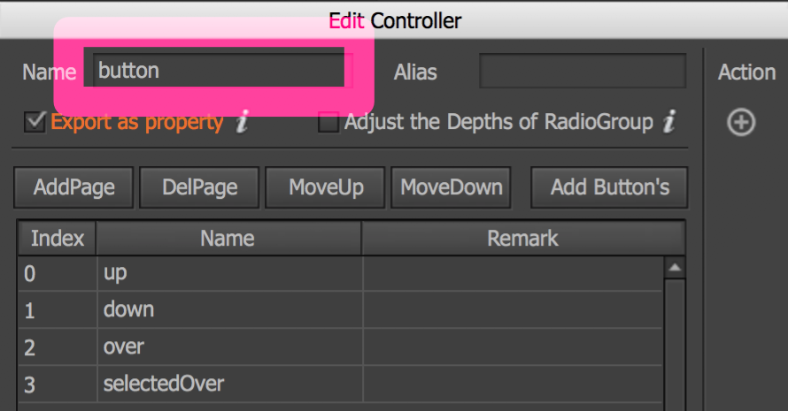

# 擴展功能-btn

## 創建方式

| 圖示 | 說明 |
| :---: | :--- |
|  | 以\(1\)或\(2\)方式, 新增擴展\(ex:按鈕\)功能。 |

除了上列方式，亦可針對已創組件\(Ctrl+F8\)設為按鈕功能。

| 圖示 | 說明 |
| :---: | :--- |
|  | 於\(1\)點擊空白處\(進入基本設置\)，在捲展欄\(2\)選「按鈕」功能，即會出現\(3\)「按鈕」設置「普通按鈕」等。   !注意:  controller需以預設button定義; 不可調整成自訂義名稱 。  |

## [Transition](transition.md)

> 請關掉自動播放，由前端控制。

## TA應用

<table>
  <thead>
    <tr>
      <th style="text-align:left">&#x6309;&#x9215;</th>
      <th style="text-align:left">&#x898F;&#x683C;</th>
    </tr>
  </thead>
  <tbody>
    <tr>
      <td style="text-align:left">&#x7CFB;&#x7D71;&#x6309;&#x9215;(&#x9078;&#x5EF3;&#x9801;)</td>
      <td style="text-align:left">
        
&#x4E0D;&#x52FE;&#x300C;&#x9078;&#x4E2D;&#x300D;

        
&#x4E0D;&#x9023;&#x63A5;&#x5834;&#x666F;

        
&#x8A2D;&#x70BA;&#x666E;&#x901A;&#x6309;&#x9215; (&#x7531;&#x524D;&#x7AEF;&#x8A2D;&#x5B9A;&#x52D5;&#x4F5C;)

      </td>
    </tr>
    <tr>
      <td style="text-align:left">&#x7CFB;&#x7D71;&#x6309;&#x9215;_&#x5DE6;&#x4E0A;(&#x4E3B;&#x904A;&#x6232;)</td>
      <td
      style="text-align:left">
        
90X90

        
&#x8DDD;&#x96E2;&#x908A;&#x754C;20

        </td>
    </tr>
    <tr>
      <td style="text-align:left">&#x64CD;&#x4F5C;&#x6309;&#x9215;(&#x4E3B;&#x904A;&#x6232;)</td>
      <td style="text-align:left">180X90</td>
    </tr>
    <tr>
      <td style="text-align:left">&#x7D50;&#x7B97;&#x756B;&#x9762;</td>
      <td style="text-align:left">&#x50C5;&#x300C;&#x7E7C;&#x7E8C;&#x904A;&#x6232;/Continue&#x300D;</td>
    </tr>
    <tr>
      <td style="text-align:left">&#x91D1;&#x984D;&#x5237;&#x65B0;&#x6309;&#x9215;(&#x5168;&#x904A;&#x6232;)</td>
      <td
      style="text-align:left">&#x7686;&#x7121;&#x9700;&#x91CD;&#x65B0;&#x6574;&#x7406;&#x6309;&#x9215;&#xFF0C;&#x53EF;&#x88FD;&#x4F5C;&#x4E26;&#x96B1;&#x85CF;</td>
    </tr>
  </tbody>
</table>