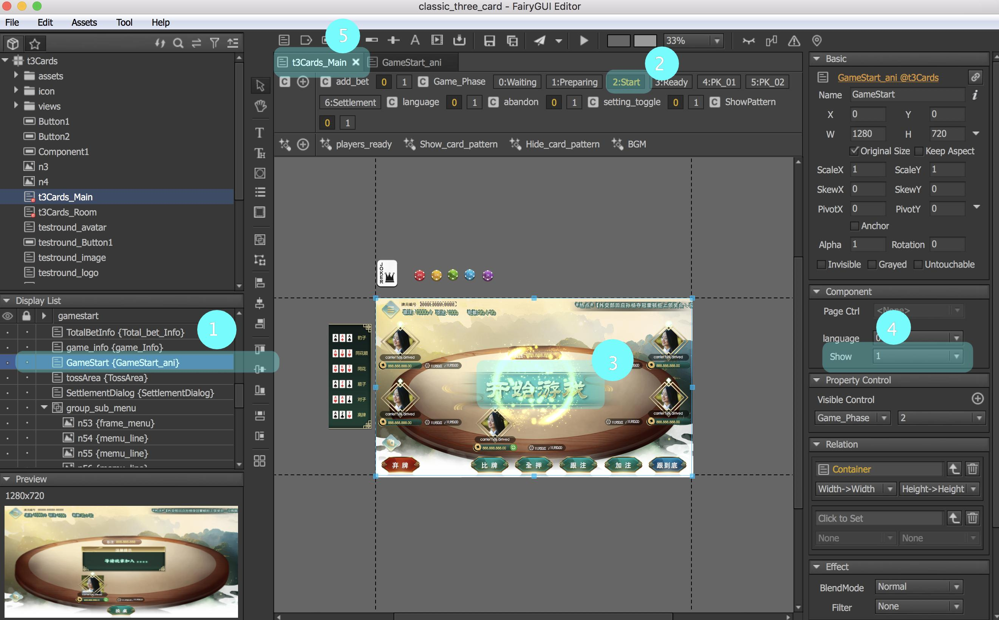

# errors

result: 無預警變動xml

重現情況:

| 圖示 | 重現步驟\(已解決\) |
| :---: | :--- |
|  | 組件選擇的情況下\(1\)，切換按鈕功能\(2\)，即時頁面更新\(3\)，此時component\(4\)已產生變動；但在Tab\(5\)沒有顯示變更提示\(\*\) |

##### 解決方式

由於fairy會預設將控制器裝載到此場景，每次更動一律需要手動選定某一項目，否則預設會以目前狀態裝載，最終導致悄悄存檔而無所知。

##### 待解

閃礫問題: \(未解決\) 可能由laya 或 fairy造成

文字輸出至平台漏字問題\(未解決\): ios 變新明體等

上傳前請確認publish目錄是否修正

原因: 雖然mac publish後看似沒有發佈，但實已發佈至專案根目錄， 並且以隱藏資料夾存儲

terminal\(顯示mac隱藏檔案\):

```text
    defaults write com.apple.finder AppleShowAllFiles TRUE;\killall Finder
```

> Read more [https://0800happy.com/8284/](https://0800happy.com/8284/)


