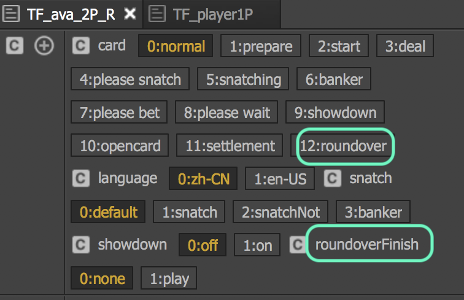

# 控制器

| 圖示 | 說明 |
| :---: | :--- |
|  | 將控制器導出至其他場景                                                     |

## ~~控制彈窗~~

| ~~圖示~~ | ~~說明~~ |
| :---: | :--- |
|  | ~~將動作&gt;改變其他控制器頁面，可用Button控制彈窗。~~ |

**命名原則**

<table>
  <thead>
    <tr>
      <th style="text-align:center">&#x5716;&#x793A;</th>
      <th style="text-align:left">&#x8AAA;&#x660E;</th>
    </tr>
  </thead>
  <tbody>
    <tr>
      <td style="text-align:center">
        
      </td>
      <td style="text-align:left">
        
&#x63A7;&#x5236;&#x5668;&#x547D;&#x540D;&#x6642;&#xFF0C;&#x8ACB;&#x907F;&#x958B;&#x91CD;&#x8986;&#x540D;&#x7A31;

        
&#x5728;&#x767C;&#x4F48;ts&#x5F8C;&#xFF0C;&#x76F8;&#x540C;name&#x6703;&#x81EA;&#x52D5;&#x547D;&#x540D;&#x800C;&#x7121;&#x6CD5;&#x5F9E;xml&#x67E5;&#x5230;

      </td>
    </tr>
  </tbody>
</table>## TA應用

<table>
  <thead>
    <tr>
      <th style="text-align:left">&#x63A7;&#x5236;&#x5668;</th>
      <th style="text-align:left">&#x898F;&#x683C;</th>
    </tr>
  </thead>
  <tbody>
    <tr>
      <td style="text-align:left">&#x8A9E;&#x7CFB;&#x63A7;&#x5236;&#x5668;</td>
      <td style="text-align:left">
        
&#x7C21;&#x4E2D;: &#x300C;zh-CN&#x300D;

        
&#x82F1;&#x6587;:&#x300C;en-US&#x300D;(&#x6CE8;&#x610F;&#x5927;&#x5C0F;&#x5BEB;)

      </td>
    </tr>
  </tbody>
</table>