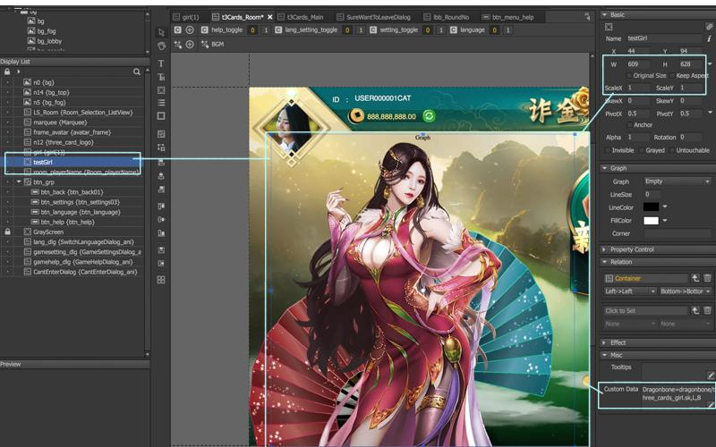

# DragonBone

## 觀念

由於fairy無法直接載入DragonBone\(DB\), 故採laya寫loader 指定該DB。

## Steps

1. 新增空物件
2. 自定義數據 

```text
Dragonbone=dragonbone/three_cards_girl.sk,L,B
```

| 圖示 | 說明 |
| :---: | :--- |
|  | 可拉圖片做reference\(請記得勾選invisible\) |
|  | 空物件設定好尺寸大小，以一空container \(scale為1\) 去裝載Dragon Bone，並在自定義數據設定代碼。 |

