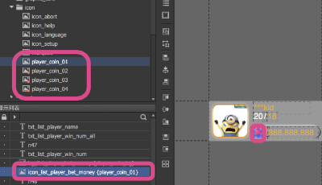

# export

> _可依情況與前端溝通_

輸出分為兩種資料夾

* 圖、fgui\(..\專案\_laya\bin\package\fgui\)
* code\(應設置為..\專案\_laya\src\ui\)

\(先行預覽\)分別置於

* 圖、fgui置於&gt;&gt;..\專案\_laya\bin\OGTFC\fgui\package
* code置於&gt;&gt;..\專案\_laya\src\ui

* ##### SKLoader等

  * 將SKLoader置於ui 資料夾內
  * 將main, binder等ts 置於src即可

##### 設置方式

除了自訂Hotkey之外，可按右鍵選定輸出

##### !注意

請將所有前端所需調用的圖片、字體，記得都設為set exported，才不會只導出該\(輸出\)場景有用到的組件而已

> 若沒將該組圖設set exported, 那將會造成前端無法調用。記得將前端所需的圖皆設為set exported。
>
> ex:前端需調用之卡/牌型/圖文字體等。

##### 

##### TA應用

| 頁面 |  |
| :---: | :--- |
| Loading | 全系列遊戲共用，由前端操作，TA無需製作 |

