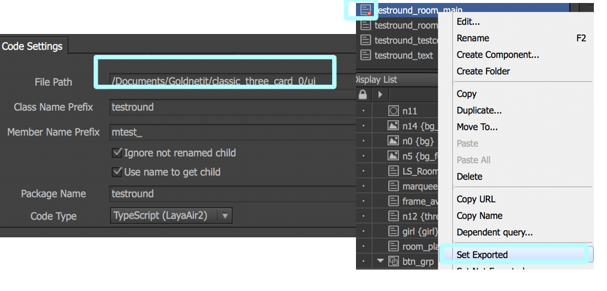
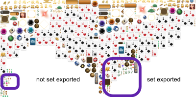

# export

* file path &gt;&gt; bin&gt;res
  * 含圖片等
* code sets:
  * file path&gt;&gt; game&gt;src&gt;ui
* ts等
  * 將SKLoader置於ui 資料夾內
  * 將main, binder等ts 置於src即可

> 欲將export 該component, 需set exported. 並於code settings指定好位址。即可在publish後在該資料夾查看到相關輸出檔案。



Tips: 請確定將所有前端所需調用的圖片設為set exported，才不會只導出場景有用到的圖片而已。

> 若是沒將該組圖設set exported, 那將會造成前端無法調用。記得將前端所需的圖皆設為set exported。 ex:前端需調用之卡/牌型/圖文字體等。
>
> 

##### TA應用

| 頁面 |  |
| :--- | :--- |
| Loading | 全系列遊戲共用，由前端操作，TA無需製作 |

