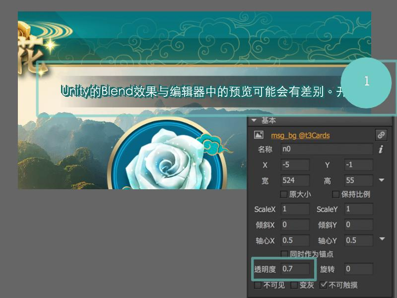

# 

#### Mask

欲設置遮罩，先點選空白處，於「基本設置」可以「自定義遮罩」\(選遮罩物件\)。

| 設置方式 | 設置效果 |
| :--- | :--- |
|  |  |

#### 透明度

|  |  |
| :--- | :--- |
|  | 若欲將某物件的透明度調整，可至基本設定去調整。 |

#### TA應用

| 彈窗 |  |
| :--- | :--- |
| 灰屏 | 透明度0.7 \(由前端操作\) |

