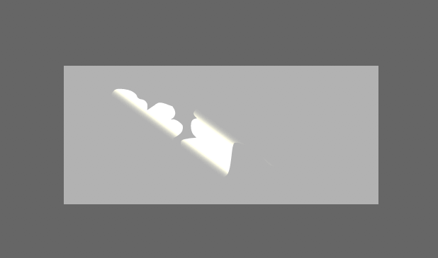

# 圖片

##### Mask

點選空白處，於「基本設置」內設定「自定義遮罩」\(選遮罩物件\)。

| 圖示 | 說明 |
| :---: | :--- |
|  |  |

##### 透明度

可於「基本」設置透明度

##### Anchor

人像圖片設中心「錨點」:  
由因前端可能需要派獎\(動畫\)跑向人像中心，故採此做法

```text
anchor="true"
```

##### TA應用

| 彈窗 | 規格 |
| :---: | :--- |
| 灰屏 | 透明度0.7 \(由前端操作\) |
| 玩家頭像 | 110X110\(!\) |


