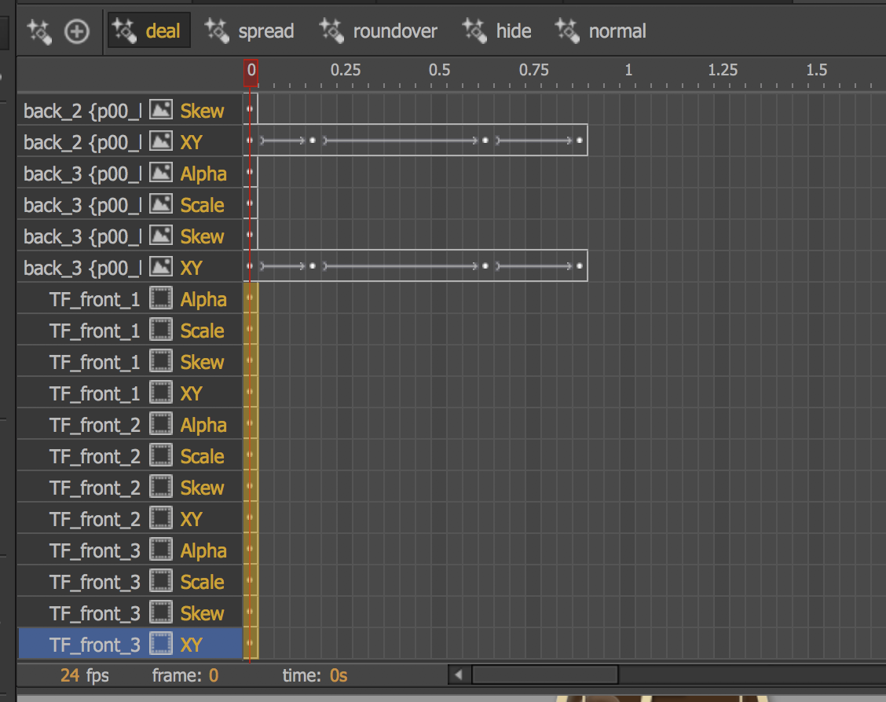

# transition

### 首幀設Key

由於動效在repeat時，會跳回第一個key幀，故在此建議第一幀無論有否動態，都Key下第一幀

## 鎖定

## 緩動函數

詳見[參考](https://greensock.com/ease-visualizer)

**動效因果關係**

## TA應用

| 動效 | 規格 |
| :---: | :--- |
| 房間按鈕 | 元件表演即可 |

