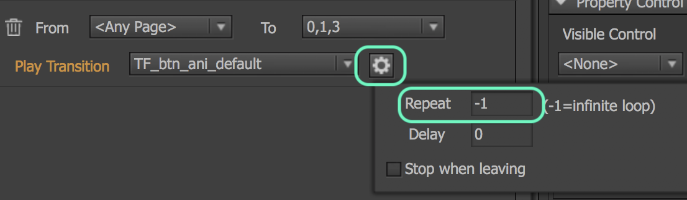

# transition

### 首幀設Key

由於動效在repeat時，會跳回第一個key幀，故在此建議第一幀無論有否動態，都Key下第一幀

<table>
  <thead>
    <tr>
      <th style="text-align:center">&#x5716;&#x793A;</th>
      <th style="text-align:left">&#x8AAA;&#x660E;</th>
    </tr>
  </thead>
  <tbody>
    <tr>
      <td style="text-align:center">
        

        

          
        

      </td>
      <td style="text-align:left">&#x5728;&#x8A2D;&#x5B8C;&#x52D5;&#x6548;&#x5F8C;&#xFF0C;&#x53EF;&#x4EE5;&#x7528;&#x63A7;&#x5236;&#x5668;&#x4F86;&#x63A7;&#x5236;&#x5176;&#x81EA;&#x52D5;&#x64AD;&#x653E;&#x72C0;&#x614B;</td>
    </tr>
  </tbody>
</table>## 鎖定

| 圖示 | 說明 |
| :---: | :--- |
|  | 當場景有多組物件，通過鎖定，可暫時將物件固定，進而方便調整小物件動畫等。 |

## 緩動函數

詳見[參考](https://greensock.com/ease-visualizer)

**動效相關**

## TA應用

| 動效 | 規格 |
| :---: | :--- |
| 房間按鈕 | 元件表演即可 |

